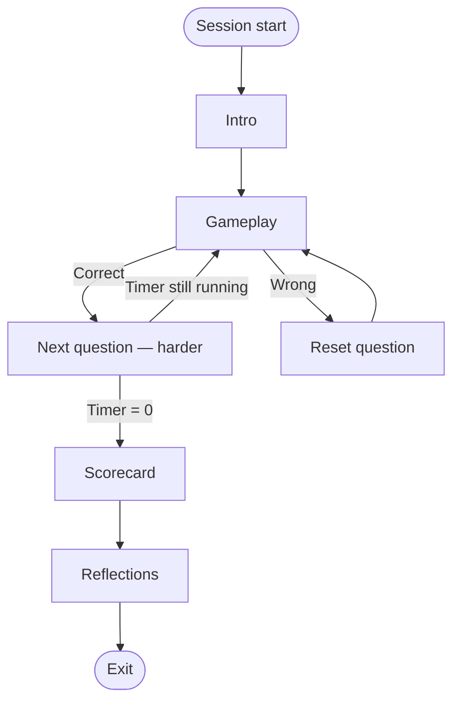
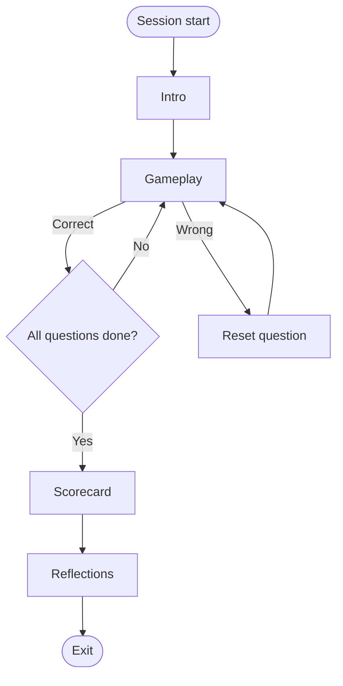
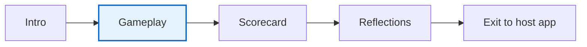
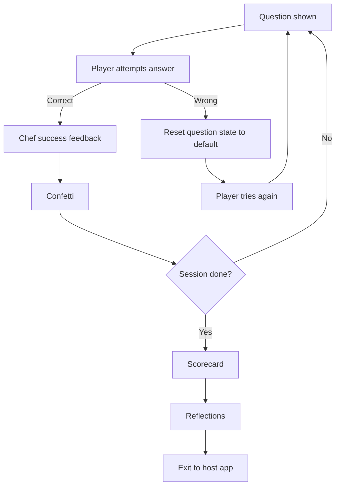
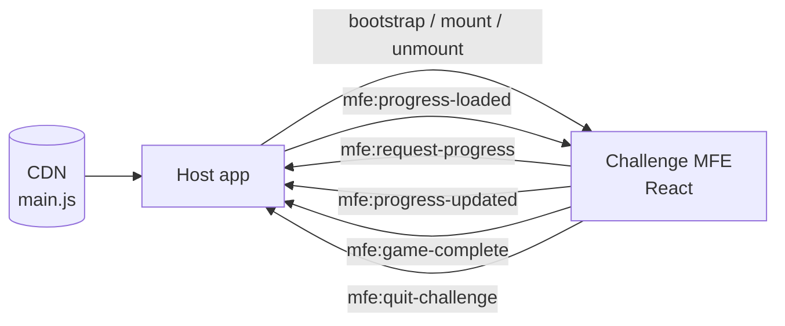
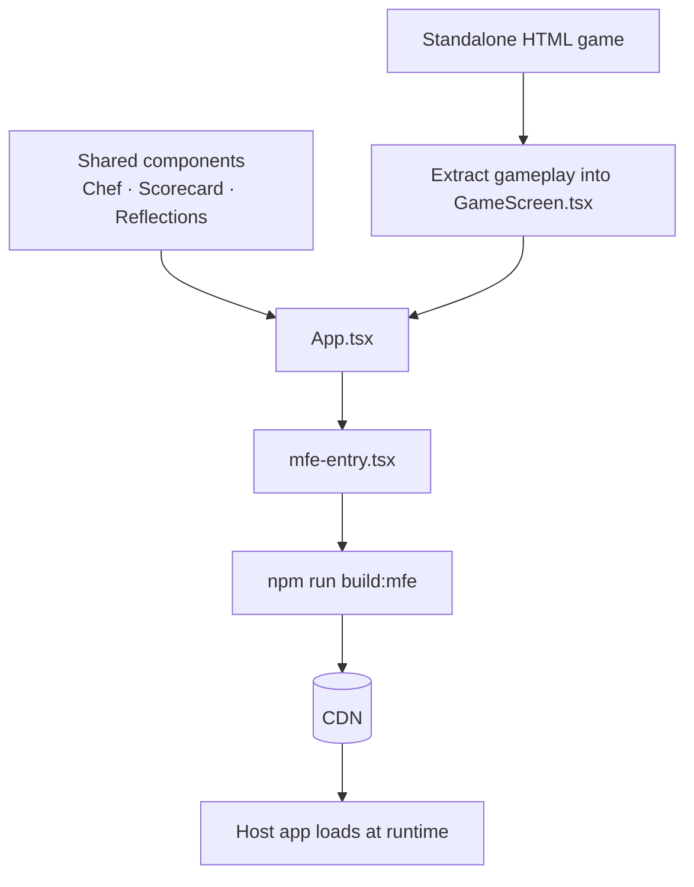
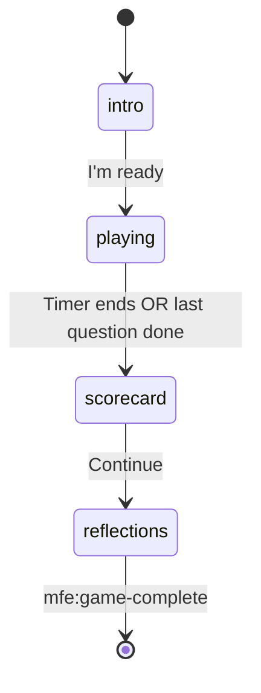
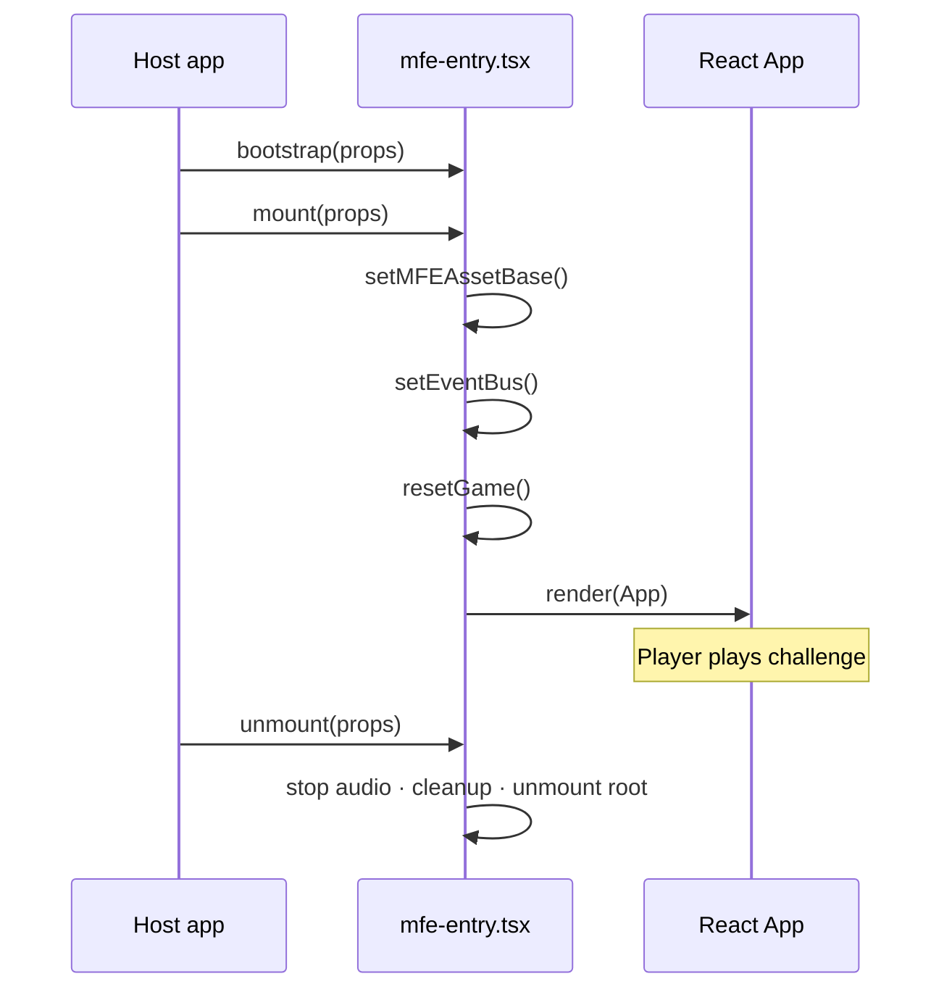
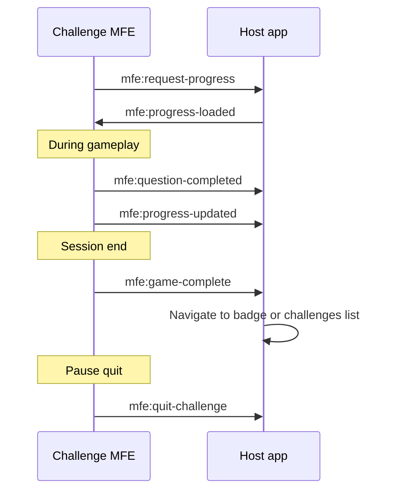

# Converting an Existing HTML Game to a Comini MFE

This guide explains how Comini challenges work, then walks you through converting a standalone HTML game into one.

---

## How Comini challenges work

### Two types of challenges

**1. Timer-based challenges**

The player has a fixed time window (usually 60 seconds). Questions keep coming one after another — as long as the timer is running and the player answers correctly, a new question appears. There is no fixed end count; the goal is to complete as many questions as possible before time runs out. Difficulty increases as the player progresses.

Examples: addition drills, sorting games under time pressure.

**2. Question-based challenges**

The player works through a **fixed number of questions** (for example, 10). They only reach the completion stage after all questions are done. There is no open-ended loop — once question 10 is answered, the game moves to the final conclusion screens.

Examples: Shadow Builder (10 spatial-reasoning puzzles), level-based story challenges.

| | Timer-based | Question-based |
|---|-------------|----------------|
| End condition | Timer reaches zero | All questions completed |
| Question count | Unlimited (until timer ends) | Fixed (e.g. 10) |
| Difficulty | Increases over time | Usually increases per question |
| Progress metric | Score / questions answered | Questions completed out of total |

**Timer-based loop:**



**Question-based loop:**



---

### Three phases every challenge shares

Every Comini challenge UI follows the same three-phase structure. **Only the gameplay phase changes per game** — the intro, scorecard, and reflections screens are reused across challenges.



| Phase | What happens |
|-------|--------------|
| **Intro** | Chef character explains the concept and how to play. The game board is visible but not yet interactive. |
| **Gameplay** | The actual challenge — unique to each game. This is the only part you build from scratch when converting an HTML game. |
| **Scorecard** | Session summary (score, questions completed, time played). Shown when the timer ends or all questions are done. |
| **Reflections** | "What you learned" screen. Stars are awarded based on performance. Player taps to finish. |
| **Exit** | Game unmounts. Player returns to the host app (challenges list or monthly badge screen). |

---

### What happens during gameplay

Within the gameplay phase, each question follows the same feedback pattern:



**Timer-based:** session ends when the timer reaches zero.  
**Question-based:** session ends when all questions are completed (e.g. 10/10).

**Example — Shadow Builder (question-based, 10 puzzles):**

1. Intro: Chef explains spatial reasoning — "Build the shape so its shadow matches the blueprint."
2. Gameplay: Player sees a 2D blueprint (left) and a 3D building island (right). They place blocks to match the shadow.
3. Per question:
   - Correct → Chef celebrates, confetti plays, advance to next puzzle.
   - Wrong → blocks on the island reset, player tries again on the same puzzle.
4. After question 10 → Scorecard shows how many puzzles were solved.
5. Reflections → stars awarded, concept recap ("You practiced seeing 3D shapes from different angles").
6. Exit → return to challenges list.

---

### Why MFE architecture

Challenges are built as **micro-frontends (MFEs)** so they can be:

- **Released independently** — ship a new game without redeploying the whole app
- **Loaded dynamically** — the host app fetches `main.js` from a CDN at runtime
- **Built in any stack** — the architecture supports different frameworks

In practice, all current mini challenges are built in **React**. Sticking with React makes it easy to reuse shared components (Chef, speech bubble, pause menu, scorecard, reflections, confetti, sound effects) from existing challenges rather than rebuilding them.



---

### What you are converting

A **standalone HTML game** is a single file (or small folder) with HTML, CSS, and JavaScript bundled together.

A **Comini challenge MFE** is that same game restructured into a React project that:

- Exports `bootstrap`, `mount`, and `unmount` so the host app can load it
- Reuses shared intro, scorecard, and reflections components
- Implements only the **gameplay phase** from your HTML
- Communicates with the host app through a small set of events (save progress, quit, complete)



---

## Before you start

You will need:

- The standalone HTML game (source or export)
- Node.js installed

---

## Step 1: Understand your HTML game

Open the standalone file and identify:

1. **Framework** — Is it React inlined in HTML? Split into `.tsx` source files.
2. **Challenge type** — Timer-based or question-based? This determines your end condition.
3. **The gameplay phase** — What is unique to your game? This is the only part you need to port. Everything else (intro, scorecard, reflections) uses shared components.
4. **Per-question logic** — What happens on correct vs wrong answer? What state resets?
5. **Assets** — Images, fonts, sounds. Note anything hard-coded or base64-encoded.

The MFE renders inside a container `div` provided by the host app, not the full browser page.

---

## Step 2: Set up your challenge folder

Create a new challenge folder at the repo root and set up these identifiers:

| What | Example |
|------|---------|
| Folder name | `shadow-builder` |
| Challenge ID | `shadow-builder` |
| Storage prefix | `sb_` |
| Package name | `shadow-builder` |

The challenge ID must match everywhere: progress service, events, and manifest.

Your folder needs the standard challenge structure — `mfe-entry.tsx`, `App.tsx`, components, store, progress service, and build config. Reuse shared components (Chef, pause menu, scorecard, reflections) and MFE wiring from the repo. Only the gameplay screen is built from your HTML.

---

## Step 3: Extract gameplay from the HTML

Your folder structure:

```
your-challenge-name/
├── mfe-entry.tsx              # MFE lifecycle
├── App.tsx                    # Orchestrates the 3 phases
├── components/
│   ├── GameScreen.tsx         # YOUR gameplay — the only custom part
│   ├── Chef.tsx               # Shared
│   ├── SpeechBubble.tsx       # Shared
│   ├── GameOverLayer.tsx      # Scorecard — shared
│   └── ReflectionsScreen.tsx  # Stars + concept — shared
├── store/useGameStore.ts
├── services/challengeProgressService.ts
└── public/assets/
```

**What to do:**

1. Move your game's JavaScript into `components/GameScreen.tsx`. This is the only component you build from scratch.
2. Move CSS into `tailwind.css` or component styles.
3. Move question/level data into `data/levels.ts` or `public/config.json`.
4. Replace hard-coded asset paths with `getAssetUrl('assets/...')`.
5. Run `npm run dev` until the gameplay phase works standalone.

**Reuse shared components (do not rebuild):**

- `Chef.tsx`, `SpeechBubble.tsx` — intro guidance
- `TopBar.tsx`, `PauseModal.tsx` — pause and quit
- `GameOverLayer.tsx` — scorecard screen
- `ReflectionsScreen.tsx` — stars and concept learned
- Confetti, sound effects, voice-over utilities

---

## Step 4: Wire up the three phases

In `App.tsx`, switch between phases using `gamePhase` in your Zustand store:

```typescript
type GamePhase = 'intro' | 'playing' | 'scorecard' | 'reflections';
```

| Phase | Component | Your work |
|-------|-----------|-----------|
| `intro` | Chef + SpeechBubble over game background | Write intro copy in `strings.ts` |
| `playing` | `GameScreen.tsx` | Port your HTML game here |
| `scorecard` | `GameOverLayer.tsx` | Configure score display |
| `reflections` | `ReflectionsScreen.tsx` | Set concept learned message |

**Transitions:**

- Intro → Playing: player taps "I'm ready" (or countdown finishes).
- Playing → Scorecard: timer ends (timer-based) OR last question completed (question-based).
- Scorecard → Reflections: player taps continue.
- Reflections → Exit: emit `mfe:game-complete` to return to host app.

For question-based games like Shadow Builder, skip countdown and "time's up" screens.



---

## Step 5: Implement per-question feedback

Inside `GameScreen.tsx`, handle each question:

**On correct answer:**
1. Play success sound effect
2. Show Chef success feedback (speech bubble)
3. Trigger confetti animation
4. Save progress (`mfe:question-completed`)
5. Advance to next question (or end session if last question)

**On wrong answer:**
1. Play error sound effect
2. Reset the question state to default (e.g. clear placed blocks, reset selections)
3. Let the player try again on the same question

**On session end (timer or last question):**
1. Call `challengeProgressService.saveGameSession(...)`
2. Set `gamePhase` to `'scorecard'`

---

## Step 6: Wire up the MFE entry point

`mfe-entry.tsx` exports three functions the host app calls:



### `bootstrap(props)`
One-time setup (fonts, etc.).

### `mount(props)`
1. Find the container element.
2. Set asset base URL: `setMFEAssetBase(props.assetBase)`.
3. Connect event bus: `challengeProgressService.setEventBus(props.eventBus)`.
4. Reset state: `useGameStore.getState().resetGame()`.
5. Render: `reactRoot.render(<App eventBus={props.eventBus} />)`.

### `unmount(props)`
1. Stop background music.
2. `challengeProgressService.cleanup()`.
3. `reactRoot.unmount()`.

---

## Step 7: Connect progress and events

The host app and your game talk through an **event bus**.



**On mount — request saved progress:**
```typescript
eventBus.emit('mfe:request-progress', { challengeId: 'your-challenge-name' });
```

**Listen for response:**
```typescript
eventBus.on('mfe:progress-loaded', (data) => {
  if (data.challengeId !== CHALLENGE_ID) return;
  if (data.previewMode) { resetProgress(); return; }
  mergeBackendProgress(data);
});
```

**During play — after each question or session end:**
```typescript
challengeProgressService.saveGameSession({ score, roundsCompleted, timePlayed });
// emits mfe:progress-updated automatically
```

**On reflections continue — exit to host:**
```typescript
eventBus.emit('mfe:game-complete', { challengeId, progress });
```

**On pause quit:**
```typescript
eventBus.emit('mfe:quit-challenge', {});
```

Pass `eventBus` as a prop from `App` to components that need it.

---

## Step 8: Build the MFE bundle

```bash
npm run dev        # Standalone development
npm run dev:mfe    # MFE mode
npm run build:mfe  # Production → dist-mfe/main.js
```

Output is a single ES module (`main.js`) with CSS injected. The host app imports this at runtime from a CDN URL.

---

## Step 9: Register in the manifest

Add an entry to `bake-store/public/challenges.json` (and release/testing manifests):

```json
{
  "id": "shadow-builder",
  "name": "@comini/shadow-builder",
  "title": "Shadow Builder",
  "mfeUrl": "https://<cdn>/challenges/v1.0.0/shadow-builder-mfe/main.js",
  "route": "/challenges/shadow-builder",
  "framework": "react",
  "enabled": true,
  "progressConfig": {
    "type": "levels",
    "totalLevels": 10,
    "storageKey": "challenge_shadow-builder_progress",
    "storageFormat": "levelsCompleted"
  },
  "access": { "guest": true, "free": true, "paid": true }
}
```

For timer-based challenges, adjust `progressConfig` to track score instead of levels.

---

## Step 10: Test locally

1. `npm run build:mfe && npm run serve:mfe`
2. Point your challenge's `mfeUrl` in `challenges-testing.json` to `http://localhost:9007/main.js`
3. Run `bake-store` and open the challenge

**Verify the full flow:**

- [ ] Intro plays with Chef guidance
- [ ] Gameplay works (correct → confetti + next; wrong → reset)
- [ ] Scorecard appears after timer or last question
- [ ] Reflections awards stars and shows concept learned
- [ ] Exit returns to challenges list (or monthly badge for signed-in users)
- [ ] Progress saves and restores on reopen
- [ ] Quit from pause works
- [ ] Audio stops on exit

---

## Step 11: Publish

1. Upload `dist-mfe/` to CDN:
   ```
   challenges/v1.0.0/your-challenge-mfe/main.js
   ```
2. Upload challenge card image and intro audio.
3. Update manifest URLs and bump version.
4. Deploy with the `bake-store` release.

---

## Troubleshooting

| Symptom | Fix |
|---------|-----|
| Previous session visible on reopen | Call `resetGame()` in `mount()` |
| Images/audio broken in production | Use `getAssetUrl()` + `setMFEAssetBase()` |
| Stars wrong on reflections | Save progress before `mfe:game-complete` |
| Host cannot load game | Export `bootstrap`, `mount`, `unmount` from `mfe-entry.tsx` |
| Demo/placeholder UI still showing | Remove preview buttons from `App.tsx` |

---

## Checklist

- [ ] Identified challenge type (timer vs question-based)
- [ ] Challenge folder set up with standard structure
- [ ] Gameplay ported into `GameScreen.tsx` only
- [ ] Intro, scorecard, reflections using shared components
- [ ] Per-question feedback wired (correct → confetti; wrong → reset)
- [ ] Three phases transition correctly
- [ ] MFE entry mount/unmount working
- [ ] Progress and completion events connected
- [ ] `build:mfe` produces `dist-mfe/main.js`
- [ ] Manifest entry added and tested locally
- [ ] Published to CDN
